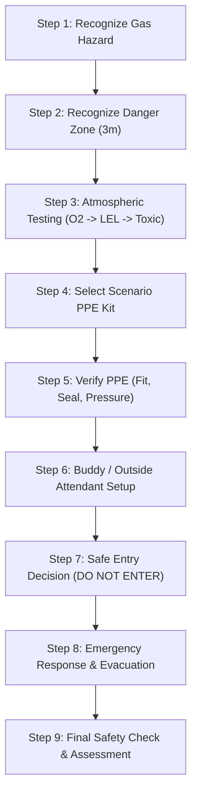

# Gas Leak & Confined Space Safety Training Module Specification

**Module Identifier**: `gas-confined-space`  
**Domain**: `gas_confined_space`  
**Content Version**: `1.0.0`  
**Target Platform**: Android (ARM64, ARCore enabled, Offline-First)  
**Supported Locales**: English (`en`), Hindi (`hi`), Santali (`sat` in Ol Chiki script)

---

> [!CAUTION]
> **SAFETY & REGULATORY DISCLAIMER**:  
> **This module is an educational simulation and does not replace site-specific confined-space permits, procedures, competent-person assessment, atmospheric testing, or trained rescue arrangements.**  
> Real-world industrial confined-space entries require formal permits-to-work, calibrated and bump-tested instrumentation, verified mechanical ventilation, certified standby attendants, and documented emergency retrieval plans in strict adherence to OSHA (29 CFR 1910.146), DGMS, and applicable workplace safety regulations.

---

## 1. Scenario Overview

A worker approaches a confined-space access portal (e.g. an underground storage vault, industrial hopper, or process vessel) in a heavy industrial facility. A hazardous gas leak and severe oxygen deficiency are present within the enclosure.

Rather than entering or relying on human senses, the worker must recognize the danger, mark and respect the 3-meter danger perimeter, initiate atmospheric testing in the mandatory OSHA sequence, select and verify scenario-appropriate PPE, establish standby attendant communication, interpret simulated sensor readings, and make the safety-critical entry decision: **DO NOT ENTER**.

When the gas alarm sounds, the worker executes a safe emergency evacuation upwind to the designated muster point and alerts the emergency supervisor, strictly avoiding improvised entry rescue.

---

## 2. Core Safety Principles

This module embeds established industrial safety principles from OSHA and NIOSH:

1. **Human Senses Cannot Detect Gas Safety**:
   - As emphasized by NIOSH, workers cannot reliably determine atmospheric safety using their senses alone. Odorless gases (e.g. Carbon Monoxide) or sensory-fatiguing gases (e.g. Hydrogen Sulfide rapidly deadens olfactory senses at dangerous concentrations) render sensory judgment hazardous or fatal.
2. **Deterministic Atmospheric Testing Order (OSHA 29 CFR 1910.146)**:
   - Atmospheric testing must proceed in the strict sequential order:
     1. **Oxygen Content ($O_2$)**: Baseline verification; oxygen deficiency or enrichment directly impacts combustible gas sensor accuracy.
     2. **Flammable Gases and Vapors ($\text{LEL}$)**: Evaluates explosion/fire risk before toxic sensors.
     3. **Toxic Air Contaminants ($H_2S$, $CO$)**: Assesses permissible exposure limits and immediate dangers to life or health (IDLH).
3. **The Core Industrial Rule**:
   - **"PPE DOES NOT MAKE AN UNSAFE ATMOSPHERE SAFE."**
   - If atmospheric readings violate permissible limits ($\text{Oxygen} < 19.5\%$, $\text{LEL} > 10\%$, or $\text{Toxic} > \text{PEL}$), entry is strictly prohibited regardless of available PPE.
4. **Dedicated Outside Attendant / Buddy System**:
   - The attendant must remain outside the confined space at all times, maintain continuous two-way communication, monitor entrant status, and initiate emergency services if conditions deteriorate.
5. **No Improvised Rescue**:
   - Over 60% of confined-space fatalities are would-be rescuers entering without adequate equipment or training. The training strictly enforces:
     $$\text{ALERT} \longrightarrow \text{ISOLATE / KEEP OUT} \longrightarrow \text{COMMUNICATE} \longrightarrow \text{TRAINED RESCUE RESPONSE}$$

---

## 3. The 9-Step Guided Workflow

| Step | Identifier | Interaction | Success Action / Event | Penalties / Violations |
| :--- | :--- | :--- | :--- | :--- |
| **1** | `step_gas_recognize_hazard` | Identify portal & vapor haze | `gas_hazard_recognized` | Premature progression rejected |
| **2** | `step_gas_danger_zone` | Mark 3m perimeter | `danger_zone_recognized` | `unsafe_zone_entry` (-5 pts) |
| **3** | `step_gas_atmospheric_test` | Run detector in OSHA sequence | `atmosphere_test_started` `atmosphere_test_step_completed` `atmosphere_assessment_completed` | Out-of-order probing rejected |
| **4** | `step_gas_select_ppe` | Select Helmet, Harness, Gloves, Boots, SCBA | `ppe_selected` | `ppe_selection_incorrect` (-5 pts, e.g. dust mask) |
| **5** | `step_gas_verify_ppe` | Fit check, seal check, cylinder test | `ppe_verified` | `ppe_verification_failed` (-5 pts) |
| **6** | `step_gas_buddy_system` | Assign attendant & test radio | `attendant_assigned` `communication_checked` | Attendant must stay outside |
| **7** | `step_gas_entry_decision` | Choose entry vs no entry | `safe_entry_decision` (`do_not_enter`) | `unsafe_entry_attempt` (-15 pts & automatic failure) |
| **8** | `step_gas_emergency_response` | Gas alarm -> Evacuate upwind -> Alert supervisor | `gas_alarm_acknowledged` `emergency_response_started` `safe_area_reached` `emergency_procedure_completed` | Improvised entry rescue strictly barred |
| **9** | `step_gas_final_safety_check` | Review compliance checklist | `gas_training_completed` | Assessment evaluated |

---

## 4. Deterministic Scoring Rubric

- **Total Score**: 100.00 points
- **Passing Threshold**: 70.00%
- **Required Rules**: All 8 rules must be satisfied to receive certification.

| Rule ID | Step ID | Points | Penalties | Evaluation Criteria |
| :--- | :--- | :--- | :--- | :--- |
| `rule_hazard_recognition` | `step_gas_recognize_hazard` | 10.00 | 0.00 | `gas_hazard_recognized` emitted with outcome `success`. |
| `rule_danger_zone` | `step_gas_danger_zone` | 10.00 | 5.00 | +10 for `danger_zone_recognized`; -5 for `unsafe_zone_entry`. |
| `rule_atmospheric_test` | `step_gas_atmospheric_test` | 20.00 | 0.00 | +20 for completing OSHA sequence (O2 $\to$ LEL $\to$ Toxic) and emitting `atmosphere_assessment_completed`. |
| `rule_select_ppe` | `step_gas_select_ppe` | 10.00 | 5.00 | +10 for `ppe_selected` (full required kit); -5 for `ppe_selection_incorrect` (dust mask/cloth mask). |
| `rule_verify_ppe` | `step_gas_verify_ppe` | 5.00 | 5.00 | +5 for `ppe_verified` (seal & fit passed); -5 for `ppe_verification_failed`. |
| `rule_buddy_system` | `step_gas_buddy_system` | 10.00 | 0.00 | +10 for `communication_checked` with attendant outside. |
| `rule_entry_decision` | `step_gas_entry_decision` | 15.00 | 15.00 | +15 for `safe_entry_decision` (`do_not_enter`); -15 for `unsafe_entry_attempt` (`enter_confined_space`). |
| `rule_emergency_response` | `step_gas_emergency_response` | 20.00 | 0.00 | +20 for completing full evacuation sequence (`emergency_procedure_completed`). |
| **Total** | | **100.00** | | |

---

## 5. Event Model Specification

All domain events conform to `TrainingEvent`:

| Event Name | Step ID | Payload Key Attributes |
| :--- | :--- | :--- |
| `gas_hazard_recognized` | `step_gas_recognize_hazard` | `action_id`, `target_id`, `hazard_type` |
| `danger_zone_recognized` | `step_gas_danger_zone` | `action_id`, `target_id`, `perimeter_radius_meters`, `standoff_maintained` |
| `unsafe_zone_entry` | `step_gas_danger_zone` | `action_id`, `target_id`, `error_reason` |
| `atmosphere_test_started` | `step_gas_atmospheric_test` | `action_id`, `standard` |
| `atmosphere_test_step_completed` | `step_gas_atmospheric_test` | `sequence_step`, `gas_type`, `reading_value`, `unit`, `status` |
| `atmosphere_assessment_completed` | `step_gas_atmospheric_test` | `overall_status`, `hazard_detected`, `o2_value`, `lel_value`, `toxic_value` |
| `ppe_selected` | `step_gas_select_ppe` | `selection_count`, `selected_items` |
| `ppe_selection_incorrect` | `step_gas_select_ppe` | `target_id`, `error_reason` |
| `ppe_verified` | `step_gas_verify_ppe` | `verification_status`, `seal_check`, `harness_fit`, `cylinder_pressure` |
| `ppe_verification_failed` | `step_gas_verify_ppe` | `verification_status`, `seal_check`, `harness_fit`, `cylinder_pressure` |
| `attendant_assigned` | `step_gas_buddy_system` | `target_id`, `attendant_location` |
| `communication_checked` | `step_gas_buddy_system` | `target_id`, `protocol` |
| `safe_entry_decision` | `step_gas_entry_decision` | `decision_id`, `atmosphere_state`, `safety_principle` |
| `unsafe_entry_attempt` | `step_gas_entry_decision` | `decision_id`, `atmosphere_state`, `error_reason` |
| `gas_alarm_acknowledged` | `step_gas_emergency_response` | `action_id` |
| `emergency_response_started` | `step_gas_emergency_response` | `action_id`, `rescue_protocol` |
| `safe_area_reached` | `step_gas_emergency_response` | `action_id`, `target_id`, `evacuation_direction` |
| `emergency_procedure_completed` | `step_gas_emergency_response` | `action_id`, `target_id`, `rescue_type` |
| `gas_training_completed` | `step_gas_final_safety_check` | `action_id`, `target_id`, `outcome` |
| `attempt_finalized` | `step_gas_final_safety_check` | `client_attempt_id`, `worker_id`, `module_id`, `score`, `passed`, `status` |

---

## 6. Offline Architecture & Retake Idempotency

- **100% Offline Capable**: Module JSON, scoring rubric, and text catalogs are bundled locally. Assessment is computed deterministically in pure C# via `LocalAssessmentEngine`.
- **Clean Retake Reset**: Invoking `GasTrainingWorkflow.Reset()` clears previous scores, resets stage to `NotStarted`, resets atmospheric sensors and PPE verification, and resets outbox finalization flags. Retakes generate fresh UUID attempts without duplicate record overwrites.

---

## 7. Localization Support

All labels, instructions, feedback strings, and dialogs are externalized in `LocaleService.cs`:
- **English (`en`)**: International standard terminology (OSHA, NIOSH, SCBA, LEL).
- **Hindi (`hi`)**: Devanagari script for vocational mining and steel workers.
- **Santali (`sat`)**: Ol Chiki script for regional tribal workforce empowerment.

---

## 8. Known Limitations (Phase 1 Foundation)

1. **Visual Representation**: This phase establishes the pure C# domain logic, scoring engine, data models, and tests. Procedural AR visual components (gas haze, danger ring, detector UI, 3D attendant marker) are scheduled for Phase 2.
2. **Single Scenario Configuration**: Default atmospheric readings simulate an unsafe oxygen-deficient, combustible, and toxic condition. Variable scenario branching (e.g. clean/safe atmospheric entry permits) will be introduced in subsequent content revisions.
